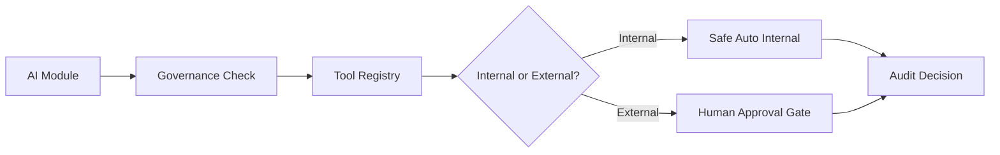
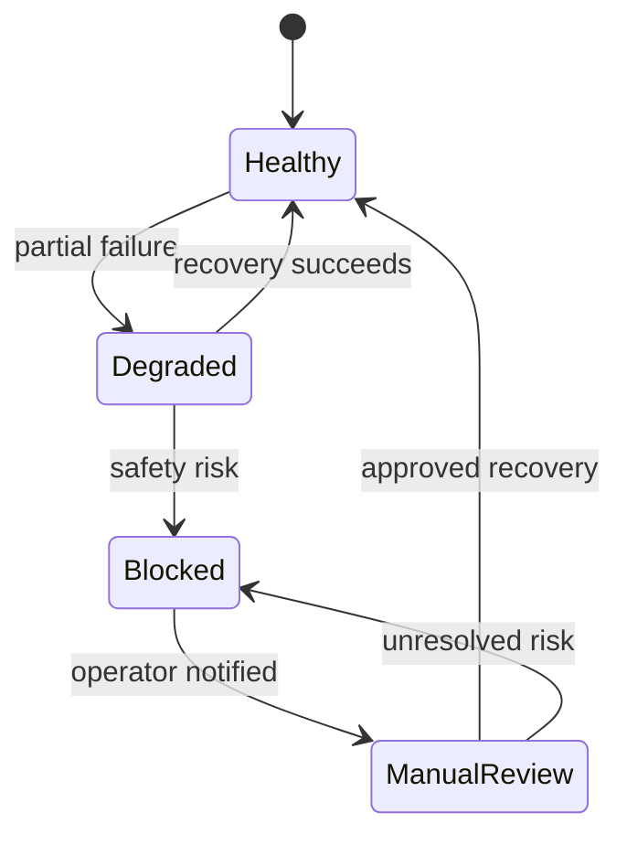

# Enterprise AI Governance & Constitution for J Capital AI OS

## Vision

### Purpose

J Capital AI OS exists to help J Capital Property Group operate a trustworthy, explainable, revenue-focused real estate investment platform while protecting property owners, partners, investors, users, and the business from unsafe automation.

### Principles

- Trust before speed.
- Source evidence before claims.
- Human judgment before external action.
- Revenue optimization without compliance shortcuts.
- Explainability before autonomy.
- Graceful degradation before silent failure.

### Rules

- No AI agent may invent property facts, deal facts, client stories, founder facts, market statistics, legal claims, tax claims, valuation claims, or relationship history.
- Every lead must track source.
- Every assumption must be labeled.
- Every external action must be approved unless a future administrator policy explicitly permits it.
- Every module inherits this constitution by default.

### Decision Hierarchy

| Priority | Rule |
| --- | --- |
| 1 | Law, consent, privacy, and platform terms control all behavior. |
| 2 | Human approval controls external action. |
| 3 | Verified source data controls factual claims. |
| 4 | Revenue priority controls sequencing only after safety checks pass. |
| 5 | AI recommendations remain advisory until approved. |

## Architecture Governance

### Purpose

The platform must remain modular, auditable, resilient, and ready for future AI agents, connectors, workflows, and business divisions.

### Rules

- Dashboard display code must not trigger external providers, outreach, publishing, scraping, or workflow execution.
- Modules must expose clear boundaries, safety flags, and approval requirements.
- Future microservices must preserve tenant isolation, auditability, versioning, and backward compatibility.
- Tool usage must route through the Tool Registry & Capability Manager.

### Flow

## Data Governance

### Purpose

Data must be accurate, sourced, classified, retained appropriately, and recoverable.

### Rules

- Property, lead, communication, financial, document, media, and relationship records require provenance.
- Sensitive information must be minimized, protected, and never exposed in client-side code or logs.
- Soft deletion, retention, archiving, backup, and recovery must be defined before durable automation expands.
- Deduplication and merge workflows require human approval.

### Data Classes

| Class | Examples | Default Handling |
| --- | --- | --- |
| Public | Public website copy, approved educational resources | Usable after brand review |
| Internal | CRM notes, draft content, task queues | Authenticated dashboard only |
| Sensitive | Contact info, seller notes, deal details | Least privilege and audit |
| Restricted | Secrets, tokens, credentials | Server-only, never logged |

## Connector Governance

### Purpose

Connectors must be approved, monitored, rate-limited, and safe to fail.

### Rules

- Official APIs first.
- CSV/manual import second.
- Browser automation only for explicitly approved sources.
- Unauthorized scraping is prohibited.
- Robots.txt and Terms of Service must be respected where applicable.
- Credentials require least privilege and rotation.
- Connector readiness does not authorize activation.

## Property Intelligence Governance

### Purpose

Property intelligence must support investment decisions without fabricating ownership, valuation, condition, title, tax, probate, or market facts.

### Rules

- County records, GIS, public records, tax records, probate records, code enforcement, permits, commercial providers, and MLS/IDX feeds require approved source handling.
- MLS/IDX data may only come through approved feeds.
- Confidence scores must include freshness, provenance, and conflict notes.
- AI recommendations must explain investment metrics and missing data.

## CRM Governance

### Purpose

CRM workflows must preserve pipeline integrity, lead ownership, activity history, and source attribution.

### Rules

- Lead creation requires source.
- Duplicate merges require approval.
- Follow-up recommendations do not authorize contact.
- Communication history must distinguish drafts, manual actions, provider calls, and sent messages.

## Revenue Spine Governance

### Purpose

Revenue intelligence must prioritize high-impact work while preserving attribution, auditability, and human control.

### Rules

- Revenue attribution, source attribution, campaign attribution, ROI calculations, assignment fee tracking, profitability, forecasting, and KPIs must be evidence-backed.
- Revenue pressure cannot override safety, consent, approval, or source requirements.
- Executive dashboards must label partial data and assumptions.

## AI Decision Governance

### Purpose

AI recommendations must be explainable, confidence-scored, logged, and bounded.

### Rules

- Every recommendation needs reason, confidence, supporting evidence, assumptions, missing data, and escalation threshold.
- Human override must always be available.
- Learning boundaries must prevent unapproved self-modification.
- Fact verification is required for property, legal, tax, valuation, market, client, and founder claims.

## Marketing Governance

### Purpose

Marketing AI must build trust and inbound demand without misleading claims or unauthorized publishing.

### Rules

- Brand voice must remain professional, transparent, local, educational, and no-pressure.
- Canva, email, SMS, website, social, GBP, reviews, SEO, ads, A/B tests, and campaign changes require approval policies.
- Drafts may be generated internally from approved sources.
- Publishing and sending remain blocked unless future governed workflows explicitly permit them.

## Closing Automation Governance

### Purpose

Closing workflows must support milestone visibility and follow-up preparation without executing legal, financial, or contractual actions autonomously.

### Rules

- Contract milestones, closing milestones, success stories, case studies, review requests, referrals, client communications, investor reporting, portfolio updates, and follow-up scheduling require approval.
- Client success stories require explicit approval before use.
- Contract generation and signature workflows require human review.

## Security Governance

### Purpose

Security controls must protect access, credentials, sessions, audit data, backups, and business continuity.

### Rules

- Authentication and authorization are required for dashboard and API access.
- Role-based access and least privilege govern all future modules.
- Secrets must never appear in responses, logs, source control, browser bundles, or audit summaries.
- Incident response, key rotation, backup security, disaster recovery, and continuity plans must be defined before live automation expands.

## Compliance Governance

### Purpose

Compliance controls must support privacy, consent, marketing rules, communication rules, retention, exports, deletion, and audit readiness.

### Rules

- Consent and DNC status must be checked before communication.
- Marketing and review requests require platform-compliant language.
- Export and deletion policies must preserve legal obligations and audit requirements.
- AI cannot provide legal, tax, probate, title, insurance, repair, or valuation advice as professional guidance.

## Monitoring Governance

### Purpose

Monitoring must detect failures, degraded tools, unsafe drift, incomplete data, and operational bottlenecks.

### Rules

- Health, connector, automation, performance, AI, error, alert, recovery, executive dashboard, and operational KPI monitoring must be visible.
- No silent failures.
- Partial failures must return data gaps and safe next steps.

## Executive AI Governance

### Purpose

Executive AI must convert business intelligence into explainable, high-ROI recommendations.

### Rules

- Strategic recommendations must include evidence, confidence, risk, expected impact, and missing data.
- Capacity planning, resource allocation, forecasting, performance reviews, and continuous improvement remain advisory unless approved.

## Human Approval Matrix

### Purpose

The approval matrix defines actions that cannot proceed without authorized human review.

| Action | Default Policy |
| --- | --- |
| Publishing | Approval required |
| Emails | Approval required |
| SMS | Approval required |
| Phone calls | Human-owned |
| Review requests | Approval required |
| Offer generation | Approval required |
| Contract generation | Approval required |
| Deleting records | Approval required |
| Merging duplicates | Approval required |
| Connector installation | Approval required |
| Automation changes | Approval required |
| Budget changes | Approval required |
| External API activation | Approval required |
| Marketing campaigns | Approval required |
| GBP updates | Approval required |
| Document generation | Approval required |
| Financial reporting | Approval required |

## AI Self-Improvement Governance

### Purpose

AI improvement must be measured, reviewed, versioned, and reversible.

### Rules

- Prompt changes, model changes, knowledge updates, recommendation tuning, and experiments require versioning.
- Rollback must be available.
- Continuous learning cannot ingest unapproved private facts into public content.

## Fail-Safe Governance

### Purpose

The system must fail safely, visibly, and recoverably.

### State Machine

### Rules

- No fabricated data.
- No silent failures.
- Retry only within safe limits.
- Rollback and manual override must exist for automation phases.
- Emergency stop must block automation immediately.

## Future Expansion Standards

### Purpose

The constitution must support accounting, construction, property management, commercial real estate, private lending, asset management, investor portals, franchise operations, new divisions, new agents, new APIs, new automation platforms, and international expansion without redesign.

### Rules

- New modules inherit this constitution by default.
- New connectors must register in the Tool Registry.
- New automation must pass Safe Auto Mode and approval policy review.
- New data domains require classification, provenance, retention, monitoring, and audit controls.

