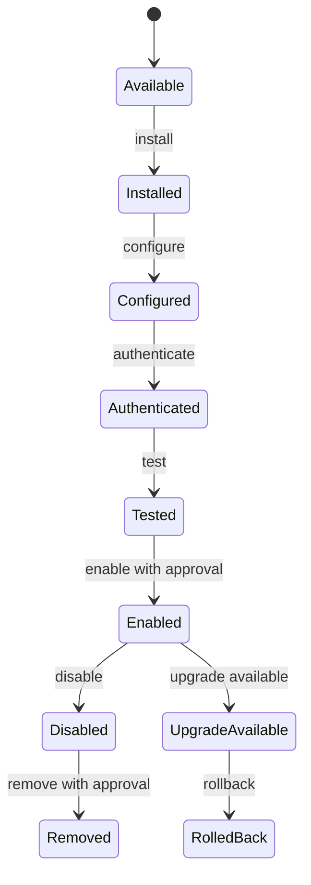
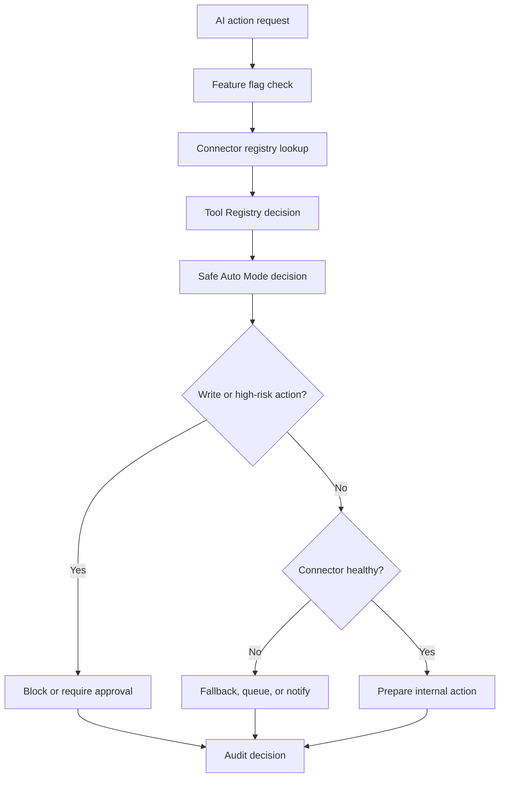

# Phase 2 Enterprise Connector, Intelligence, and Safe Autonomy Platform

## Purpose

Phase 2 extends J Capital AI OS from governance-first readiness into a modular enterprise AI operating system foundation. It adds connector metadata, feature flags, market intelligence, demand discovery, growth engine foundations, and executive briefings while preserving Safe Auto Mode and human approval gates.

## Default Safety Posture

| Capability | Phase 2 Foundation Default |
| --- | --- |
| Connector platform visibility | Enabled |
| Safe Auto Internal | Enabled |
| Live connector reads | Disabled |
| Live connector writes | Blocked |
| Publishing | Blocked |
| Messaging | Blocked |
| Budget changes | Blocked |
| Offer/contract execution | Blocked |
| Unauthorized scraping | Blocked |

## Feature Flags

| Flag | Default |
| --- | --- |
| `connector_platform` | Enabled |
| `safe_auto_internal` | Enabled |
| `connector_live_reads` | Disabled |
| `connector_google` | Disabled |
| `connector_microsoft` | Disabled |
| `connector_meta` | Disabled |
| `connector_marketing` | Disabled |
| `connector_communication` | Disabled |
| `connector_property_data` | Disabled |
| `market_intelligence` | Disabled |
| `demand_discovery` | Disabled |
| `personal_brand` | Disabled |
| `relationship_engine` | Disabled |
| `executive_briefings` | Disabled |
| `safe_auto_limited` | Disabled |

## Connector Lifecycle

## Connector Decision Flow

## APIs

- `GET /api/connectors/registry`
- `GET /api/connectors/[connectorId]`
- `GET /api/connectors/[connectorId]/health`
- `POST /api/connectors/[connectorId]/lifecycle`
- `POST /api/connectors/actions/evaluate`
- `GET /api/intelligence/market`
- `GET /api/intelligence/demand`
- `GET /api/intelligence/executive-briefing`
- `GET /api/growth/personal-brand`
- `GET /api/growth/relationships`

## Audit Requirements

- Connector action decisions must record action, connector, module, reason, confidence, approvals, fallback, provider-call status, and live-execution status.
- Intelligence outputs must include source labels, provenance, missing data, and confidence.
- Growth drafts must preserve approval status and no-send/no-publish flags.
- Executive briefings must explain why each priority matters.

## Future Activation Requirements

Before any live connector read:

- Feature flag enabled.
- Connector registered.
- Health check defined.
- Audit policy defined.
- Credential reference configured without exposing secrets.
- Admin approval recorded.
- Safe fallback defined.

Before any live connector write:

- Separate approval policy.
- Human confirmation.
- Audit before and after execution.
- Rate-limit and cost guardrails.
- Rollback or mitigation plan.
- Kill switch.

