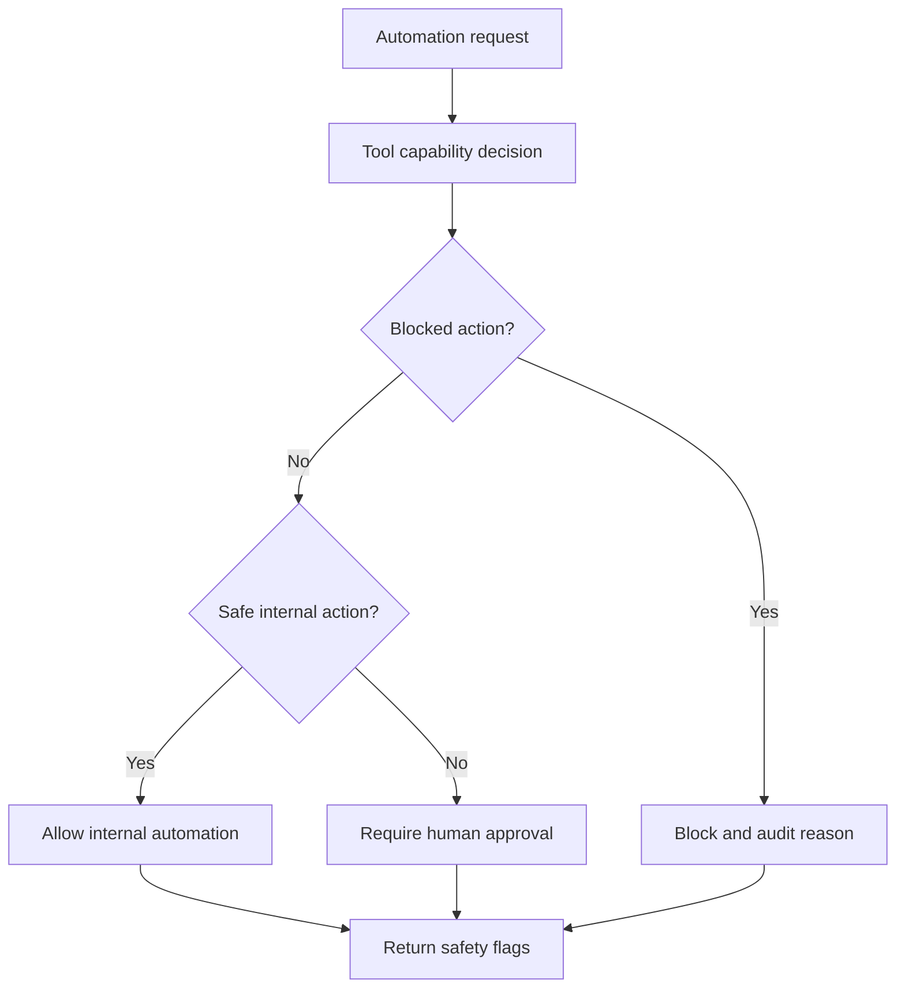

# Safe Auto Mode

## Purpose

Safe Auto Mode lets J Capital AI OS automate high-ROI internal work while keeping risky external actions behind approval gates. It supports the move toward automation without allowing silent sending, publishing, scraping, connector activation, budget changes, or external commitments.

## Automation Levels

| Mode | Allowed Behavior | External Actions | Default |
| --- | --- | --- | --- |
| Manual | Recommendations and drafts only | None | No |
| Assisted | Drafts plus approval queues | Human-approved only | No |
| Safe Auto Internal | Internal scoring, summaries, drafts, queues, and briefs | None | Yes |
| Safe Auto Limited | Selected approved external actions under limits | Governed by future policy | No |

## High-ROI Internal Automation

- ROI opportunity scoring.
- Internal executive summaries.
- Personal brand draft generation from approved sources.
- Content repurposing from approved drafts.
- Relationship health scoring.
- Follow-up draft preparation.
- Macro signal summaries from approved or manually imported sources.
- Tool fallback recommendations.
- Approval queue preparation.

## Blocked In V1

- SMS or email sending.
- Phone calls.
- Social publishing.
- Google Business Profile publishing.
- Ads or budget changes.
- Calendar invite sending.
- Connector activation.
- OAuth starts.
- Unauthorized scraping.
- External submissions.
- Offer or contract execution.

## Automation Decision Flow

## Default Flags

| Flag | Value |
| --- | --- |
| autoInternalSummaries | true |
| autoRoiScoring | true |
| autoDraftCreation | true |
| autoRelationshipHealthScoring | true |
| autoContentRepurposingFromApprovedSources | true |
| autoMacroSignalSummaries | true |
| autoExternalProviderCalls | false |
| autoPublishing | false |
| autoMessaging | false |
| autoCalling | false |
| autoCalendarInvites | false |
| autoConnectorActivation | false |
| humanApprovalRequiredForExternalActions | true |
| killSwitchEnabled | true |

## Audit Requirements

Every safe automation decision must include:

- Mode.
- Requested action.
- Selected tool.
- Fallback tool.
- Risk level.
- Expected ROI.
- Approval requirement.
- Reason.
- Provider call status.
- Send/publish/schedule status.
- Live execution status.

## Acceptance Criteria

- Safe internal automation can run without calling providers.
- External execution stays blocked.
- Blocked actions return clear reasons.
- Tool failures and rate limits fallback or block.
- Tests prove provider calls, sends, publishes, and schedules remain false.

