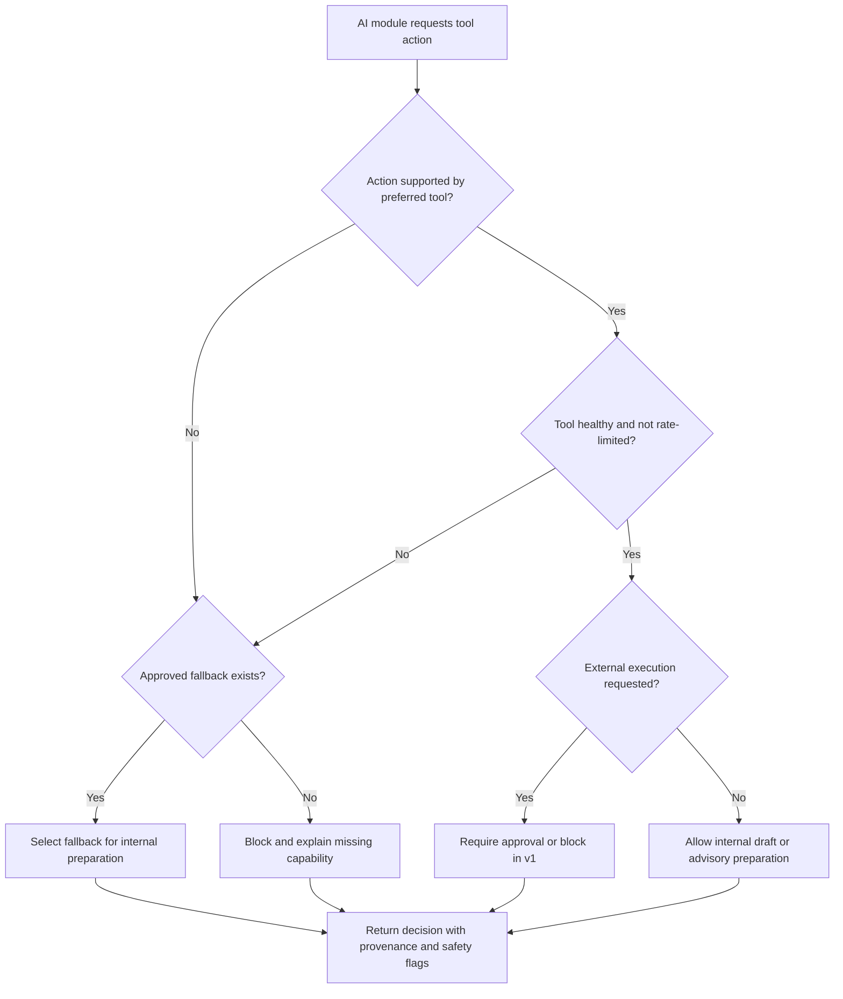

# Tool Registry & Capability Manager

## Purpose

The Tool Registry & Capability Manager is the shared capability layer for J Capital AI OS. It lets Executive AI, Revenue Spine, Marketing AI, Personal Brand Engine, Relationship Engine, Property Intelligence, Macro Intelligence, and future agents understand which tools exist, what each tool can safely do, what approvals are required, and which fallback should be used when a tool is unavailable.

## Operating Principles

- Tool readiness never grants execution authority.
- Official APIs are preferred when approved, but v1 keeps live provider calls blocked.
- Every tool decision must be explainable, auditable, and safe by default.
- Every external action requires human approval unless a future administrator policy explicitly permits it.
- Failed or rate-limited tools must degrade to an approved fallback or blocked decision.
- No secrets may appear in API responses, logs, UI, decision metadata, or audit summaries.

## Required Tool Metadata

| Field | Requirement |
| --- | --- |
| Name | Human-readable tool name. |
| Purpose | Clear business reason for the tool. |
| Version | Registry version for compatibility review. |
| Authentication method | API key, OAuth, manual, public source, or none. |
| Required permissions | Scopes, roles, or manual access requirements. |
| Health status | Healthy, degraded, rate-limited, unavailable, or readiness-only. |
| Supported actions | Explicit list of actions the tool can perform or prepare. |
| Rate limits | Window, maximum requests, and remaining capacity when known. |
| Cost per call | Estimated or observed cost where applicable. |
| Last successful run | Last known safe successful use. |
| Last failure | Last known failure and reason. |
| Retry policy | How the system should retry, queue, fallback, or block. |
| Owner | Business owner responsible for tool readiness. |
| Audit history | Safe operational notes and decision records. |
| Approval requirements | Required human, compliance, budget, or connector approvals. |

## V1 Registered Tool Families

| Family | Examples | V1 Status |
| --- | --- | --- |
| Property data | County Assessor, ATTOM, GIS, county records | Readiness or manual-review only |
| Marketing | Canva, Google Business Profile, Facebook, Instagram, LinkedIn, X, TikTok, YouTube | Draft-only |
| Communication | Twilio, email provider, Google Calendar | Draft/task-only |
| Analytics | GA4, Search Console, GBP analytics, Meta analytics | Readiness-only |
| AI providers | OpenAI, Gemini, xAI | Gated by provider policy |
| Workflow | n8n, Vercel, Docker, Postman | Readiness/manual operations only |
| Macro intelligence | RSS/news registry, licensed news providers, economic sources | Approved-source registry only |

## Decision Flow

## Safe Defaults

| Capability | V1 Default |
| --- | --- |
| Provider calls | Blocked |
| Publishing | Blocked |
| Sending messages | Blocked |
| Calling | Blocked |
| Scraping | Blocked |
| OAuth starts | Blocked |
| Connector activation | Blocked |
| Internal drafts | Allowed |
| Internal summaries | Allowed |
| ROI scoring | Allowed |
| Relationship health scoring | Allowed |
| Macro summaries from approved/manual sources | Allowed |

## Example Decisions

| Request | Expected Decision |
| --- | --- |
| Canva should create a flyer | Select Canva for internal design brief; require brand/content approval; no Canva API call. |
| GBP should prepare a post | Select GBP prepare-post capability; publishing blocked; manual publish checklist only. |
| County Assessor should verify ownership | Select county records/manual verification; require source evidence. |
| ATTOM is unavailable | Fallback to county records; do not call ATTOM. |
| Twilio is rate-limited | Queue manual follow-up task or SMS draft; notify operator; do not send. |

## Audit Requirements

- Record requested module, action, selected tool, fallback, approval requirement, confidence, and reason.
- Record provider call status as false in v1.
- Record blocked reasons for unavailable, rate-limited, unsupported, or unapproved actions.
- Preserve safe metadata only.
- Do not store secrets, tokens, full message payloads, or sensitive private facts in audit summaries.

## Testing Requirements

- Tool registry must expose all required capability fields.
- Tool decisions must never allow live execution in v1.
- Unavailable tools must fallback or block.
- Rate-limited tools must not send.
- Publishing and messaging actions must remain blocked.
- API responses must preserve `providerCalled:false` and `liveExecutionAllowed:false`.

